```{r setup, include=FALSE}
knitr::opts_chunk$set(echo = TRUE)
```

## 1. Abstracto/Resumen

Este estudio analiza los efectos del consumo de zumo de arandanos (tratamiento Cranberry) sobre el perfil metabolomico de mujeres de 21 a 29 años en comparacion con el consumo de zumo de naranja (tratamiento Apple) y condiciones basales (Baseline). A partir del conjunto de datos con 1451 metabolitos y 45 muestras (por cada condicion), se realizo un limpieza y transformacion de los datos conservando 1359 metabolitos para el analisis. Se aplicaron tecnicas de exploracion iniciales de los datos, analisis de componentes principales (PCA) y clustering jerarquico para evaluar la estructura global de los datos el cual no revelo diferencias evidentes entre los tres grupos a nivel global pero si diferencias sutiles para el grupo de zumo de arandanos. Posteriormente se utilizo un ANOVA y el test de Tukey para identificar metabolitos diferencialmente expresados en los tratamientos, complementado con volcano plots y un heatmap. A pesar de que los cambios observados fueron sutiles, se pudieron identificar varios metabolitos que mostraron diferencias significativas para el tratamiento con zumo de arandanos. Esto sugiere que este tratamiento podria inducir a cambios metabolomicos abriendo la puerta a estudios mas en detalles sobre su impacto biologico.

## 2. Objetivos

El objetivo principal fue explorar las posibles diferencias en el perfil metabolomico asociado al consumo del zumo de arandano (Cranberry) y el zumo de naranja (Apple) en comparacion con condiciones basales (Baseline) en muestra biologicas de mujeres. Mediante un enfoque exploratorio, se pretendio determinar si existen diferencias globalos o especificas en la concentracion de matabolitos dentre los distintos grupos de muestras.

Para ello se aplicaron diferentes metodos estadisticos y de visualizacion: un analisis exploratorio inicial, reduccion de dimensionalidad mediante analisisi de componentes principales, tecnicas de agrupamiento y analisis de concentracion diferencial. Adicionalmente se evalua la relevancia estadistica y la magnitud de los metabolitos mediante volcano plots heatmaps para validar los biomarcadores potenciales.

Este trabajo se presenta dentro de un marco de un analisis exploratorio preliminar que pretende una primera aproximacion a los efectos de los tratamientos (zumo de arandanos y manzana) mencionados, sobre el perfil metabolomico, que pueda sentar una base para estudios posteriores mas especificos.

## 3. Metodos

### Origen y naturaleza de los datos

Los datos fueron obtenidos del repositorio de gitHub proporcionado y son de un estudio metabolomico basado en muestras de orina y sangre obtenidas de mujeres de entre 21-29 años. El diseño experimental es el siguiente: las participantes siguieron una recomendacion dietetica de no tomar alimentos que pudieran interferir con el estudio durante 6 dias y al septimo dia se toma una muestra basal ("Baseline"), luego fueron separadas en dos grupos de manera aleatoria y cada grupo ingirio durante los proximos tres dias 250ml de zumo de arandanos o de manzana cada mañana y cada tarde (dando lugar a "Cranberry" y "Apple"). El dia diez se toman otra vez muestras de orina y sangre, depues de dos semanas de vida normal los grupos se invierten y se realiza otra vez las mediciones. Un total de 15 muestras completas (de 15 mujeres) fueron obtenidas para cada grupo. 

El dataset incluye: una matriz de expresion con 1541 metabolitos y 45 muestras (15 por cada paciente y tratamiento, "Baseline", "Cranberry" y Apple"), los metadatos con la asignacion de los tres grupos de tratamiento para cada muestra y un archivo de metadatos de los metabolitos incluyendo los nombres y los codigos identificadores de puBChem y KEGG.

### Preprocesamiento de los datos

Los datos de los tres archivos "features.csv", "metadata.csv" y "metaboliteNames.csv" se cargaron  y a partir de estos se creo un objeto "SummarizedExperiment" (SE), facilitando la gestion conjunta de matriz de expresion, muestras y metadatos. Se eliminaron del SE los metabolitos con valores faltantes en todas las muestras, un total de 182, reduciendo a 1359 metabolitos. Para todos los analisis se aplico una transformacion logaritmica en base 10 para reducir la varianza y asimetria de los diferentes metabolitos. En los analisis que requerian comparacion entre metabolitos se aplico un escalado tipo z-score (centrado en media de 0 u desviacion estandar 1, es decir normalizacion estandar) por metabolito.

En respuesta al punto 2 de la PEC sobre las diferencias entre el objeto ExpressionSet y el usado aqui SummarizedExperiment, ambas son clases de R diseñadas para organizar datos de expresion (genomicos, transcriptomicos, metabolomicos etc) junto con metadatos de muestras y variables. El ExpressionSet es un objeto mas antiguodesarrolado inicialmente para microarrays permitiendo almacenar una unica matriz de expresion junto con las anotaciones de muestras y de genes/metabolitos. El SummarizedExperiment por otro lado es una version mas moderna de  que permite almacenar multiples matrices de expresion (llamadas assays) y tienen funcionalidades mas robustas a traves de colData y rowData. Esta ultima se integra pues mejor con las herramientas de analisis mas modernas y por lo tanto es mucho mas recomendado su uso en general a pesar de que el objeto ExpressionSet se mantiene por razones de compatibilidad.

### Analisis exploratorio

Se generaron boxplots por muestra de la escala original, log10 y log10 mas escalado para visualizar la distribucion general de las intensidades de los metabolitos para cada muestra. Se estudio la estructura global (los tres grupos) de los datos mediante un analisis de componentes principales PCA) calculando los primeros 40 componentes de los cuales se presentan graficos para PC1 Vs PC2 y PC2 Vs PC3 mediante graficos de dispersion y se listaron los metabolitos con mayor carga para los tres primeros componentes.

### Clustering Jerarquico

Se procedio con un clustering jerarquico sobre las muestras usando la distancia euclidiana y metodo de enlace Ward.D2 de los datos log10 escalados. Se obtuvo un dendrograma con la finalidad de interpretar visualmente la presencia de agrupamientos naturales segun el tratamiento.

### Analisis diferencial

Se realizo un ANOVA de un solo factor (grupo de tratamiento) a cada metabolito. Los valores p se ajustaron usando el metodo de Benjamini-Hochberg (FDR). Se seleccionaron los 10 metabolitos con cambios mas significativos (con menor valor p ajustado) y se aplico una prueba de post hoc Tukey para identificar, entre pares de grupos, que metabolitos presentaban los cambios mas significativos. Se genero un heatmap con los 20 metabolitos mas significativos del ANOVA, visualizando sus perfiles de intensidad por muestra y agrupados por similitud en cmabios de intensidad. Se contruyo tambien un grafico volcano para comparar directamente los tratamientos "Cranberry" y "Baseline" por un lado  y "Cranberry y Apple" por otro, con test t por metabolito, deferencias de medias (log10) y valor p ajustado (log10), se etiquetaron los 10 metabolitos con cambios de mayor magnitud. Se genero un heatmap con los 20 metabolitos mas significativos del ANOVA, visualizando sus perfiles por muestra agrupados por similitud en el perfil de intensidad de los metabolitos.

## 4. Resultados

### Exploracion inicial de los datos

Antes del analisis de los datos se realizo una exploracion inical de los datos para comprender su estructura general y evaluar si fuera necesario hacer algun preprocesado de los datos. Se evaluo la distribucion de los valores de expresion metabolica de las 45 muestras recogidas pertenecientes a los tres grupos experimentales "Baseline", "Apple" y "Cranberry".

La figura 1 muestra boxplots de los datos de expresion por mustra para los datos en crudo, escalado por log 10 y escalados y normalizados. Los datos crudos muestran una varianza de muchas ordenes de magnitud entre las concentraciones de los diferentes metabolitos, el escalado a log10 ayudo a estabilizar la varianza y reducir la asimetria visualmente, el boxplot de datos log10 muestra una mediana alrededor de 1e+06 y muchos menos puntos marcados como outliers. En este boxplot se observa algo de varianza entre muestras pero la distribucion en escala log10 es bastante homogenea lo que sugiere que no hay efectos de muestras aberrantes evidentes. Finalmente se repitio el boxplot con los datos escalados y normalizados (z-score por metabolito) mostrando una vez mas la homogeneidad de las muestras a nivel global de todos los metabolitos, este ultimo procesado sera el usado para analisis comparativos entre metabolitos.

```{r boxplot, fig.cap="Comparacion de la distribucion de expresion de metabolitos por muestra (A) datos crudos, (B) datos log 10, (C) datos log10 normalizados", out.width="32%", fig.show='hold', echo=FALSE}
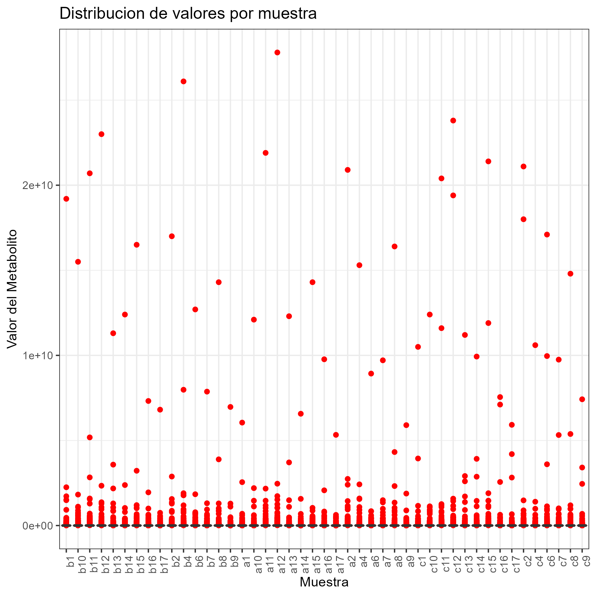
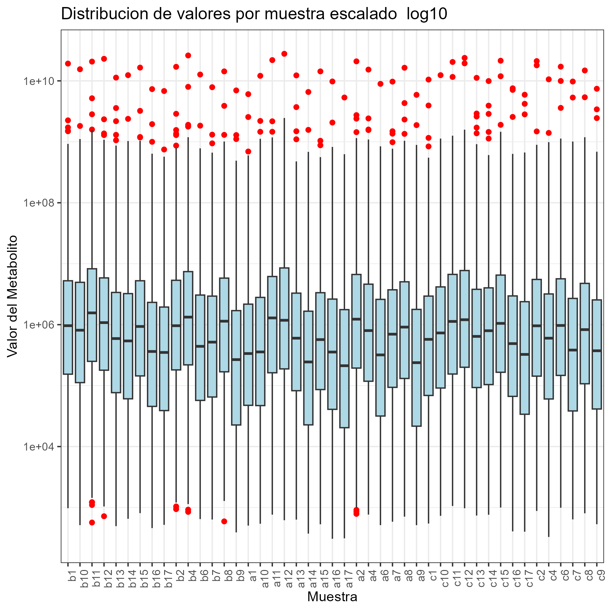
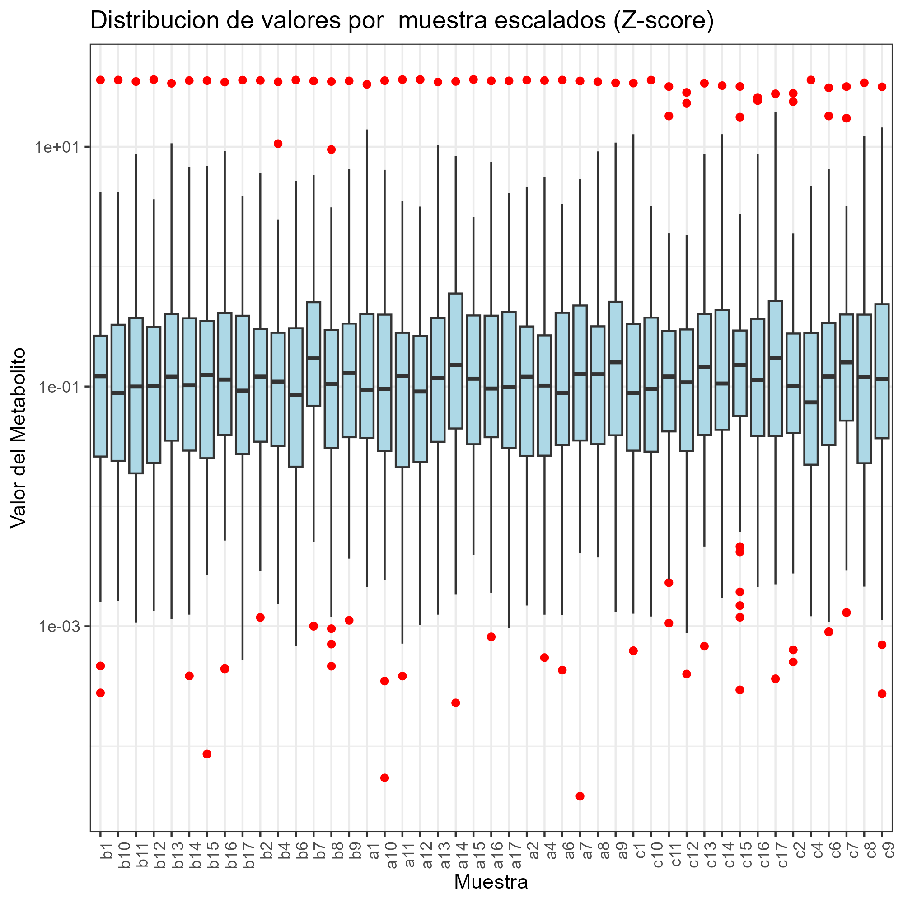
```

Finalmente se evaluo la presencia de valores NA por muestra y metabolito. Todas las muestras presentaban un numero identico de valores NA y observando los valores NA por metabolito coincidian en los mismos 182 metabolitos que estaban todos vacios. Esto descarto la necesidad de excluir ninguna muestra en especifico y junto con la homogeneidad muestral observada en los boxplots se decidio simplemente eliminar los 182 metabolitos sin datos reduciendo la matriz de expresion de 1541 a 1359 metabolitos (los graficos de los NA se muestran en el anexo como figura 6).

### Analisis de componentes principales (PCA)

Con el objetivo de detectar posibles patrones de metabolitos relacionados con los distintos tratamientos a nivvel global (de todos los metabolitos), se aplico un analisisi de componentes principales (PCA) sobre los datos previamente escalados (log10) y normalizados (z-score). Se calcularon los primeros 40 componentes principales, que explicarton el 97.7% de la varianza de los datos. En la figura 7 (ver anexo) se observa la varianza acumulada explicada por cada PC progresivo y no se oberva ningun punto de inflexion o "codo", esto indica que cada componente adicional aporta progresivamente a la explicacion de la varianza sin que exista un numero claramente optimo de componentes (hasta llegar a los 40). A pesar de esto se decidio explorar los primeros 3 PC que colectivamente expliquen solo el 42.6% de la varianza, a pesar de estar lejos del 97.7 % este valor del 42.6% es razonable para un estudio metabolomico con mas de mil metabolitos.

La figura 2 muestra los graficos de dispersion de los componentes PC1 contra PC2 y PC1 contra PC3 respectivamente. En ambos se observa una muy ligera separacion del grupo Cranberry especialmente a lo largo del componente PC3 (en la direccion diagonal arrib a la izquierda y abajo a la derecha del grafico derecho de PC1 Vs PC3), sin observarse una separacion muy clara dado que el sobrelapaje entre los tres grupos es evidente. Los vectores de carga destacados en azul tambien apuntan hace la misma direccion (figura 2 derecha) arriba a la izquierda indicando los metabolitos que mas explican la varianza de los PC1 y PC3. De este analisis se infiere que si bien puede haber indicios de difrencias metabolicas asociadas al consumo del arandano estas diferencias son bastante sutiles y no dominan los primeros tres componentes. Los 10 metabolitos mas influyentes, es decir con mayor contribucion (carga) a cada componente fueron identificados y se muestran en la figura 8 (ver anexo). Cabe destacar que de estos 30 metabolitos ninguno coincide con los metabolitos destacados como diferencialmente representados en las tres condiciones en la seccion de analisis diferencial.

```{r pca, fig.cap="(A-B) Graficos de dispersion de PC1 Vs PC2 y PC1 Vs PC3: las muestras hasn sido coloreadas por tratamiento Baseline en gris, Apple en verde y Cranberry en rojo, los vectores muestran los metabolitos que mas contribuyen a los PC mostrados y las elipsis muestran agrupaciones de los tres grupos con el 95% de confianza. A nivel global de todas la muestras no se aprecia una separcion significativa de los tres grupos en los primeros tres componentes. En el componente 3 se aprecia una separacion ligera del grupo de Cranberry.", out.width="49%", fig.show='hold', echo=FALSE}
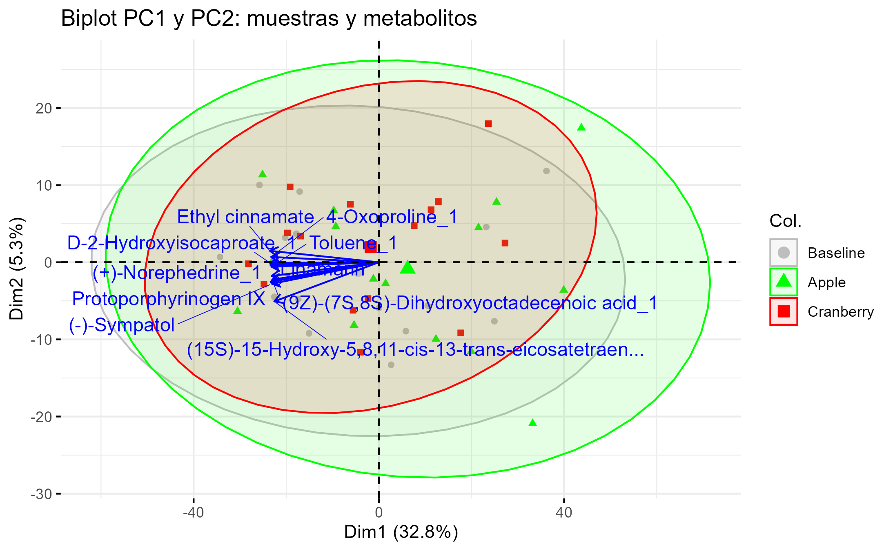
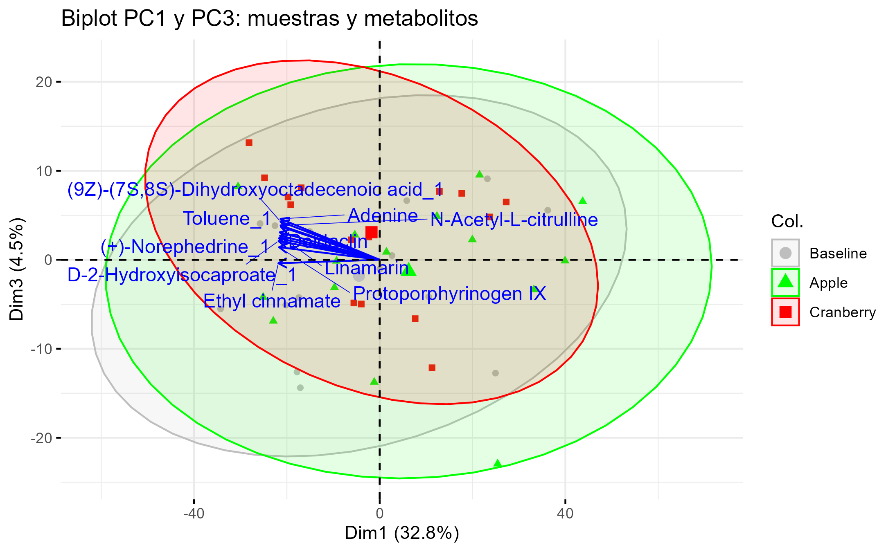
```

### Clustering jerarquico

Para explorar posibles agrupaciones naturales entre las muestras en funcion de su perfil metabolico, dado que el tratamiento de arandanos mostro una ligera separacion en el analisis de componentes principales, se decicio realizar un analisisi de clustering jerarquico. Para ello se utilizo la distancia euclediana entre las mestras calculada sobre los datos escalados (log10) y normalizados (z-score) por metabolito. El metodo de enlace empleado fue Ward.D2, con la intencion de favorecer la formacion de clusteres compactos y con baja varianza interna (homogeneos). Dado que los resultados del PCA que sugieren diferencias que, como mucho, son sutiles entre los tratamiento, esta eleccion es razonable.

La figura 3 muestra el dendrograma obtenido, a pesar de que se puede aprecier cierto agrupamiento de algunas muestras de Cranberry (c8, c12, c6, c7, c11, y c15) en la aprte derecha del dendrograma, estos no forman parte exclusiva de un clade separado en la parte alta del dendrograma. de hecho estan mezcaldos con muestras de los otros tratamientos. En general no hay una separacion clara en la parte alta del dendrograma y los grupos en la parte baja del dendrograma son mas bien heterogeneos sin obervarse agrupamientos claros. Esta falta de estructura sugiere que, a nivel global, las posibles diferencias inducidas por el tratamiento son, una vez mas, sutiles y como mucho afectan a subconjuntos especificos de metabolitos en lugar de alterar el perfil metabolomico completo.

Este resultado es consistente con lo observado en el analisis de PCA donde tampoco se evidencio una separacion clara entre grupos de tratamiento y por lo tanto se decicdio no seguir con tecnicas de clustering no jerarquico como k-means y enfoncarse mas en los siguientes analisis de comparaciones directas entre los grupos mediante analisis estadisticos diferenciales.

```{r jerarquico, fig.cap="Dendrograma del agrupamiento jerarquico por muestras basado basado en las concentraciones de metabolitos. No se aprecia una agrupacion significativa a nivel de expresion global.", out.width="49%", fig.show='hold', echo=FALSE}
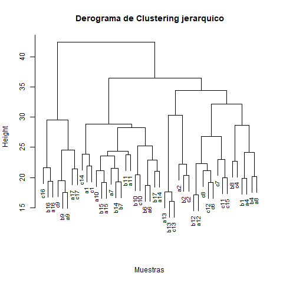
```

### Analisis  diferencial

Como siguiente paso el foco del analisis se convirtio en identificar metabolitos cuya representacion difiere de manera significativa entre los diferentes tratamientos, los resultados anteriores indican que si bien hay indicios que estos existen, es posible que no sean muy numerosos y que sus diferencias sean mas bien sutiles. Se realizo un analisis de varianza (ANOVA) de un solo factor, que permite evaluar si existen diferencias significativas en la media de concentracion/representacion de cada metabolito entre los grupos de tratamiento.

Este analisis se aplico a las concentraciones de metabolitos tranformados a log10 para el total de 1359 metabolitos conservados tras el filtrado de NAs. Dado que este analisis no indica donde reside esta diferencia (que tratamiento contra que tratamiento) para los 10 metabolitos con cambios mas significatibos se realizo un analisis post hoc de comparaciones multiples mediante el test de Tukey, que permite identificar entre que pares de grupos (tratamientos en este caso) existen diferencias significativas.

Los resultados de este analisiis se muestran en la Tabla 1 (ver anexo) que incluye el nombre del metabolito, las diferencias de las medias (log10) y los valores p ajustados. De los 10 metabolitos identificados como diferencialmente expresados en el ANOVA un total de 20 comparaciones fueron identificadas como significativas con el analisis de Tukey, y de esas 20 comparaciones, 19 ocurrieron entre los tratamientos de Cranberry y Apple o Cranberry y Baseline, lo que sugiere que el tratamiento con zumo de arandanos es el que genera cambios mas marcados en los perfiles metabolomicos.

Para examinar mas en detalle los cambios especificos en los perfiles metabolomicos inducidos por el tratamiento de arandano, se realizaron comparaciones pareadas mediante volcano plots, un grafico que permite identificar simultaneamente metabolitos con cambios significativos estadisticamente y de gran magnitud. Se compararon los grupos de Cranberry Vs Baseline y Cranberry Vs Apple, utilizando un test t por metabolito, seguido de un ajuste de los valores p mediante el metodo de Benjamini-Hechberg (FDR) para tener en cuenta el numero de comparaciones realizadas y reducir el reisgo de falsos positivos. En ambos casos se calcula la diferencia de medias entre grupos en escala log10.

La figura 4 muestra los volcano plots (Cranberry contra Baseline a la izquierda y Cranberry contra Apple a la drecha) con un linea roja marcando el limite de p < 0.05 (en esala log10) separando por encima los metabolitos con diferencias estadisticamente significatvas de los inferiores. En rojo estan marcados los 10 metabolitos con mayor cambio absoluto acompañados de su nombre. Los resultados muestran un numero limitado de metabolitos en los cuadrantes superiores para ambas comparativas. Aquellos resaltados como de mayor magnitud en el tratameinto de arandanos frente a los dos tratamiento, es decir metabolitos que estan mas representados tanto en el tratamiento de arandanos frente a a la medicion basal como frente al tratamiento con manzada son: L-Formylkynurenine_1, Kikanol A, 2,3,6-Trihydroxypyridine, 5-Nitro-ortho-anisidine_1, 6Beta-Hydroxy-17beta-estradiol Robustaol A y Benzthiazuron. Cabe destacar que de estos 7 metabolitos identificados por este metodo, los 4 primeros tambien fueron destacados como entre los 10 mas significativos en el analisis de comparaciones del NOVA  mas Tukey (ver tabla 1) reforzando su relevancia.

```{r diferencial-volcano, fig.cap="Volcano plots comparando los niveles de metabolitos entres los grupos de tratamiento. (izquierda) comparacion entre Cranberry y Baseline, (derecha) comparacion entre Crabnerry y Apple. Cada punto corresponde a un metabolito segun la magnitud del cambio log10 fold change en el eje x y su significancia estadistica -10log valor p ajustado en el eje y. Las lineas azules indican el umbral de cambio de 1 log10 y la linea roja la significancia estadistica de p< 0.05. En rojo se han marcado los 10 metabolitos con mayor cambio absoluto en cada comparacion.", out.width="50%", fig.show='hold', echo=FALSE}
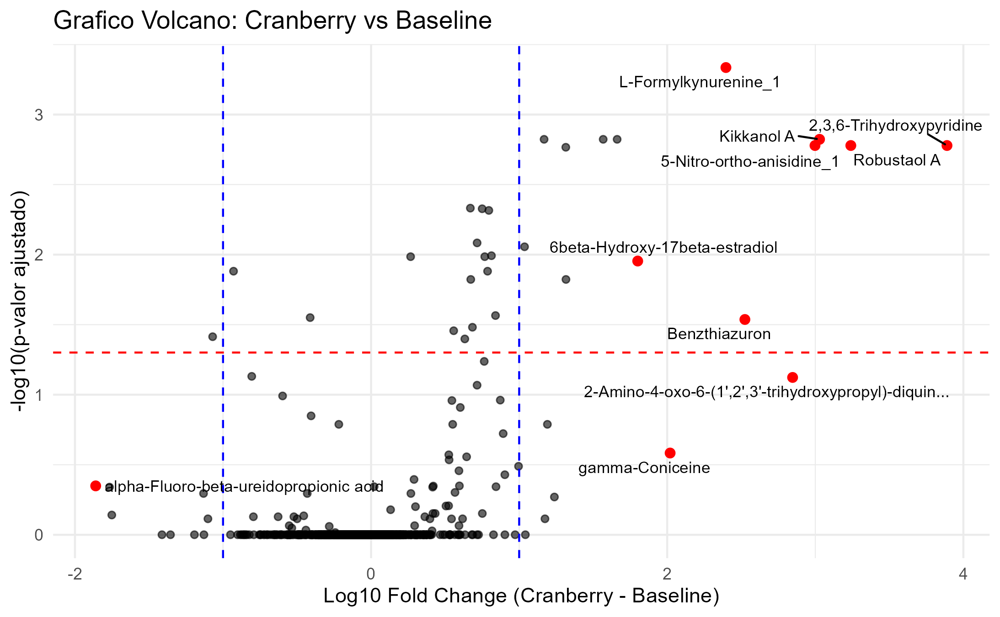
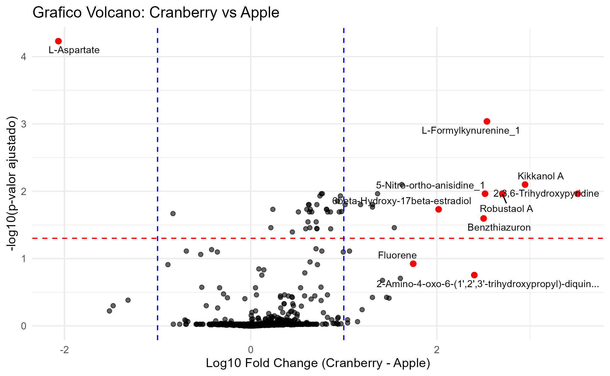
```

Con el objetivo de visualizar los patrones de expresion de los metabolitos mas relevantes entre todos los grupos de tratamiento, se contruyo un heatmap utilizando los 20 metabolitos mas significativos segun el analisis ANOVA (menor valor p ajustado). En la figura 5 se muestra el heatmap donde las filas corresponden a metabolitos y la columnas a las muestras, el escalado y normalizado de las muestras garantiza que cada fila (metabolito). Los colores representan el nivel realtivo de concentracion con el rojo indicando un nivel superior a la emdia y el azul un nivel inferior. 

A diferencia del dendrograma que se relizo con los datos de todos los metabolitos en este caso los 20 metabolitos con diferencias mas significantes si que resultaron en un agrupamiento mas marcado de las muestras de arandanos (coloreadas en azul en la barra de tratamiento) reforzando la evidencia de un efecto diferencial del tratamiento con arandanos al menos para un grupo limitado de metabolitos.

```{r diferencial-heatmap, fig.cap="Heatmap de las concentracioes de los 20 metabolitos mas significaticvos segun ANOVA (menor valor p ajustado), valores en log10 y normalizados por metabolito. Cada fila representa un metabolito y cada columna una muestra. Los colores indican la conetracion realtiva: rojo indica una intensidad por encima de la media y azul por debajo de la media. El dendrograma superior muestra el agrupemiento jerarquico de la muestras revelando una separacion parcial del grupo Cranberry.", out.width="80%", fig.show='hold', echo=FALSE}
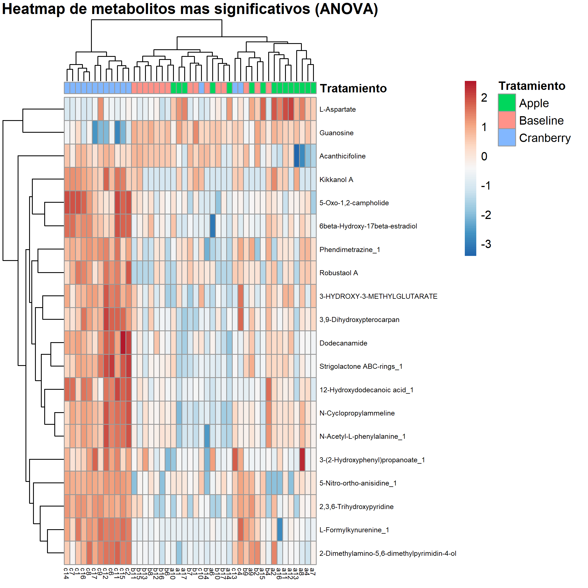
```

\newpage

## 5. Discusion

Los analisis aqui presentados revelaron patrones sutiles pero consistentes en la representacion metabolomica del grupo de zumo de arandanos en comparacion con las muestras basales y el grupo de zumo de manzana. Aunque el analisisi exploratorio y el PCA no mostraron un separacion clara entre los tres grupos, el PCA si que mostro una diferenciacion debil en el componente PC3 especialmente para el grupo de zumo de arandanos. El analisis de agrupamiento jerarquico no mostro una diferenciacion de los tres grupos a nivel general de todos los metabolitos. Con este indicio de que el tratamiento con zumo de arandanos podria haber causado un efecto a nivel metabolico, aunque fuera reducido, se procedio al analisis diferencial.

El analisis diferencial mediante ANOVA y complementado con pruebas post hoc de Tukey y volcano plots conjuntamente permitio identificar un grupo reducido de metabolitos cuyas concentraciones difieren significativamente entre el tratamientos con zumo de arandanos y tanto la medicion basal como el tratamiento con zumo de arandanos respectivamente. Los metabolitos L-Formylkynurenine_1, Kikanol A, 2,3,6-Trihydroxypyridine y 5-Nitro-ortho-anisidine_1, fueron identificados por multiples metodos, reforzando asi su relevancia como potenciales marcadores del tratamiento.

Como extension del analisis exploratorio presentado en este documento seria conveniente realizar un analisis de enriquecimiento metabolico utilizando tanto los 4 destacados por multiples metodos como una lista mas extensa aquellos que fueron destacados por el ANOVA para evaluar su asociacion con rutas biologicas especificas.

Finalmente se ha de resatar que el estudio en si presenta limitaciones importantes, en primer lugar el tamaño muestral es reducido con n=15 reduciendo el poder estadistico para detectar efectos pequeños. Tampoco se dispone de datos clinicos u otros aspectos fisiologicos acerca de las pacientes (tan solo que son muejres entre 21-29 años) lo que limita el poder de contextualizar mas alla de un analisis diferencial metabolomico entre los tres grupos.

## 6. Conclusiones

Este analisis exploratorio de datos metabolomicos exploro el efecto del consumo de zumo de arandanos en comparacion con condiciones basales y el consumo de zumo de manzana. Usando una combinacion de analisis exploratorio inicial, reduccion de dimensionalidad mediante PCA, agrupamiento jerarquico y analisis estadistico diferencial se evidenciaron patrones sutiles pero consistentes que diferenian al grupo de zumo de arandanos del resto.

Si bien la separacion entre tratamientos no fue contundente en los primeros componentes principales, los analisis estadisticos diferenciales si que evidenciaron que el grupo de zumo de arandanos presentaba perfiles metabolomicos diferenciados y en particular se destacaron de manera reiterada varios metabolitos: L-Formylkynurenine_1, Kikanol A, 2,3,6-Trihydroxypyridine y 5-Nitro-ortho-anisidine_1 con una mayor concentracion en el grupo de zumo de arandanos.

Estos resultados indican que el tratamiento con zumo de arandanos podria tener un efecto a nivel metabolomico y sientan las bases para estudios mas detallados. Seria muy relevante realizar el estudio de enriquecimiento mencionado para investigar si los metabolitos destacados estan implicados en rutas metabolicas comunes a la vez que validar estos hallazgos con cohortes independientes.

## 7. Referencias

En el siguiente link https://github.com/carnapa/Navarro-Paya-Carlos-PEC1 esta el repositiorio donde se puede encontrar los datos crudos en la carpeta "/datos", las figuras resultantes del analisisi en la carpeta "/figuras", el codigo comentado  usado apra el analisisi en un documento Markdown "Codigo-analisis-Navarro_paya-Carlos_PEC1.rmd" y el objeto SE con los datos crudos "summarizedExperiment.rda" como indica el enunciado.

## 8. Anexo

```{r anexo1, fig.cap="Anexo 1: Analisis de valores NA por muestra (izquierda) y metabolito (derecha). Solo se presentaron valores NA en los ultimos metabolitos y para todas las muestras por igual.", out.width="49%", fig.show='hold', echo=FALSE}
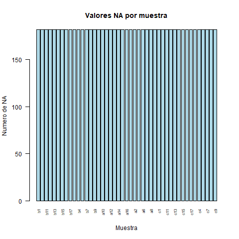
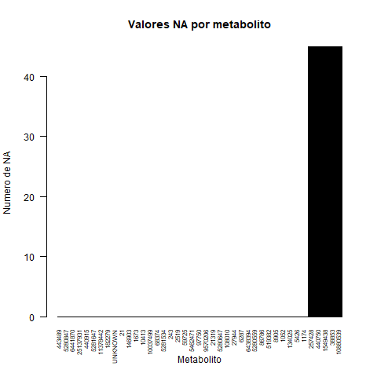
```

```{r anexo2, fig.cap="Anexo 2: Varianza acumulada explicada por componentes PC1 a PC40", out.width="49%", fig.show='hold', echo=FALSE}
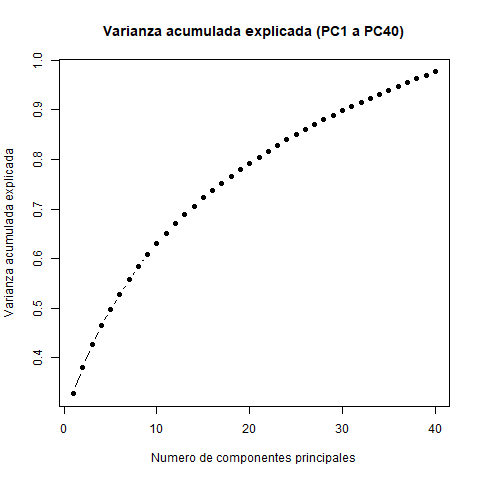
```

```{r anexo3, fig.cap="Anexo 3: Lista de los 10 metabolitos mas influyentes por componente principal: (izquierda) PC1, (centro) PC2 y (derecha) PC3. Ninguno de estos metabolitos coinciden con los relatados por el analisis comparativo entre tratamientos.", out.width="32%", fig.show='hold', echo=FALSE}
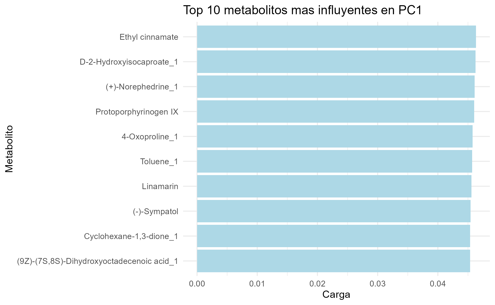
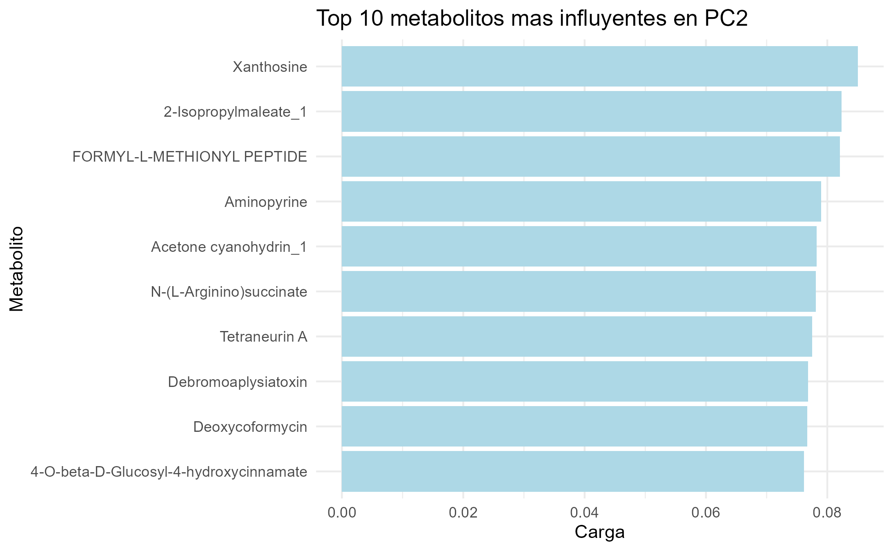
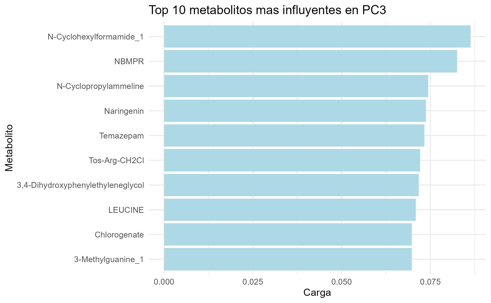
```

```{r ANOVA_tukey, echo=FALSE}
tabla_comparaciones = read.csv("figuras/ANOVA_tukey.csv")
knitr::kable(tabla_comparaciones, caption = "Tabla de metabolitos con diferencias significativas en comparaciones de los diferentes grupos de tratamiento.")
```
